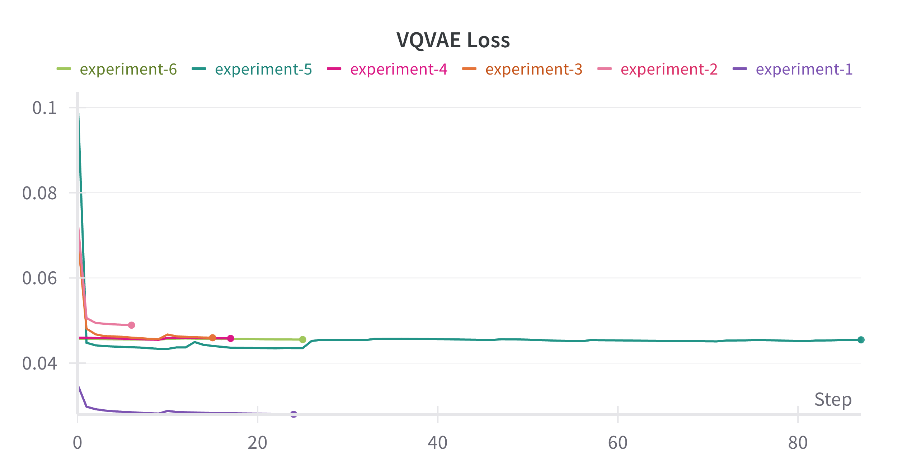
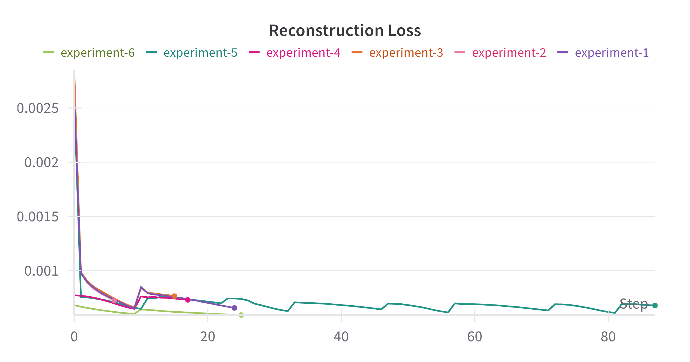
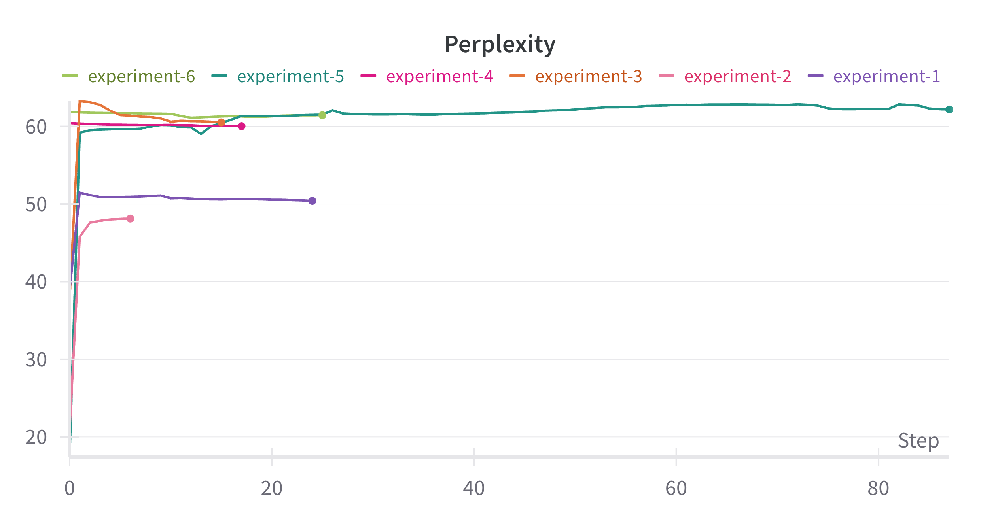
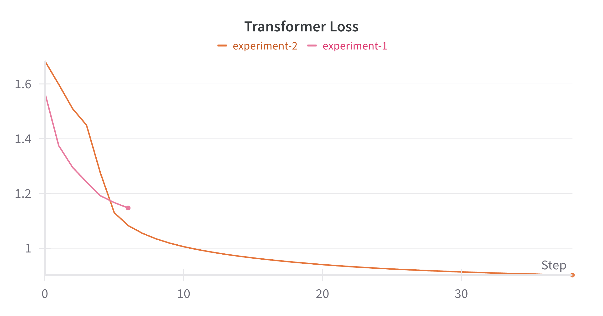
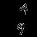

# Video-Generation-Flowing-MNIST

This project explores deep learning-based video generation using a hybrid model that combines **Convolutional Neural Networks (CNNs)** and **Long Short-Term Memory (LSTM)** units. The model is trained on the **Moving MNIST** dataset to predict future frames of handwritten digits in motion.

## Dataset: Moving MNIST

The **Moving MNIST** dataset consists of 10,000 video sequences. Each sequence contains:

* **20 grayscale frames**, each of size **64×64 pixels**
* **Two handwritten digits** moving independently and randomly within the frame
* Digits **bounce off the frame boundaries** and often **intersect or overlap**

---

## Approach 1: ConvLSTM Model

The first approach uses a **ConvLSTM model**, which integrates convolutional operations into LSTM units, allowing the model to capture both spatial and temporal dynamics effectively.

### Model Details

* Input: First 10 frames of a sequence
* Output: Next 10 predicted frames
* Architecture: Convolutional-LSTM network
* Loss Function: Mean Squared Error (MSE)
* Optimizer: Adam
* Trained for: 70 Epochs

### Generated Video

Sample of a 20-frame video result from the trained ConvLSTM model:

<!--  -->

---

## Approach 2: Vision Transformer (ViT)

A Transformer-based model using patch embeddings and spatiotemporal attention to predict future frames.

### Model Highlights

* **Patch Embedding**: Each 64×64 frame is divided into 8×8 patches.
* **Transformer Encoder**: 6-layer encoder captures space-time relations.
* **Decoder**: Linear + ConvTranspose layers reconstruct full frames.
* **Input/Output**: 10 input frames → 10 predicted frames
* **Loss**: MSE along with integrating VGG-based Perceptual Loss.

### Generated Video

Sample of a 20-frame video result from the trained VIT model:

---

## Approach 3 : VQVAE along with Transformer

### Model Highlights
* codeBookdim: 128
* embedDim: 64
* hiddenDim: 256
* Optimizer: Different learning rate for encoder, decoder, and for CodeBook vectorization
* Trained the Codebook Vector Over Time with Transformer Decoder Only Model

### Training Plots:
<!-- ###  Total VQ-VAE Loss Over Epochs -->
<!-- 

### Reconstruction Loss Over Epochs

### Codebook Perplexity Over Epochs

### Transformer-Decoder Over Epochs
 -->

<table>
  <tr>
    <td>
      

      <h4>Total VQ-VAE Loss Over Epochs</h4>
      

      
    </td>
    <td>
      

      <h4>Reconstruction Loss Over Epochs</h4>
      

      
    </td>
  </tr>
  <tr>
    <td>
      

      <h4>Codebook Perplexity Over Epochs</h4>
      

      
    </td>
    <td>
      

      <h4>Transformer-Decoder Over Epochs</h4>
      

      
    </td>
  </tr>
</table>

#### Results
<table>
  <tr>
    <th>Input (10 Frames)</th>
    <th>Output (20 Frames)</th>
  </tr>
  <tr>
    <td align="center"></td>
    <td align="center"></td>
  </tr>
</table>

---

## Approach 4 : Text to Video Generation

### Step 1 Dataset Creation
